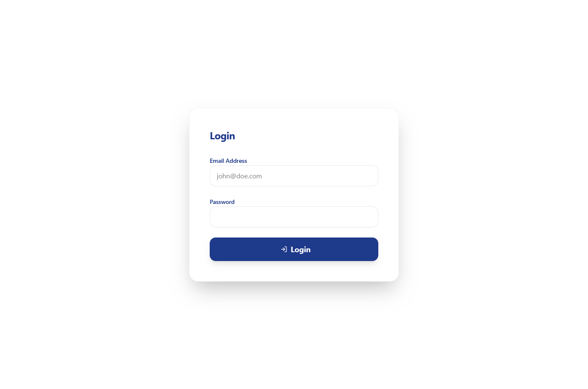
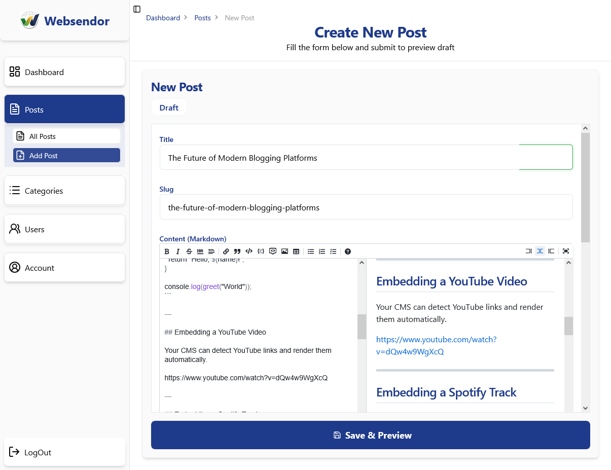
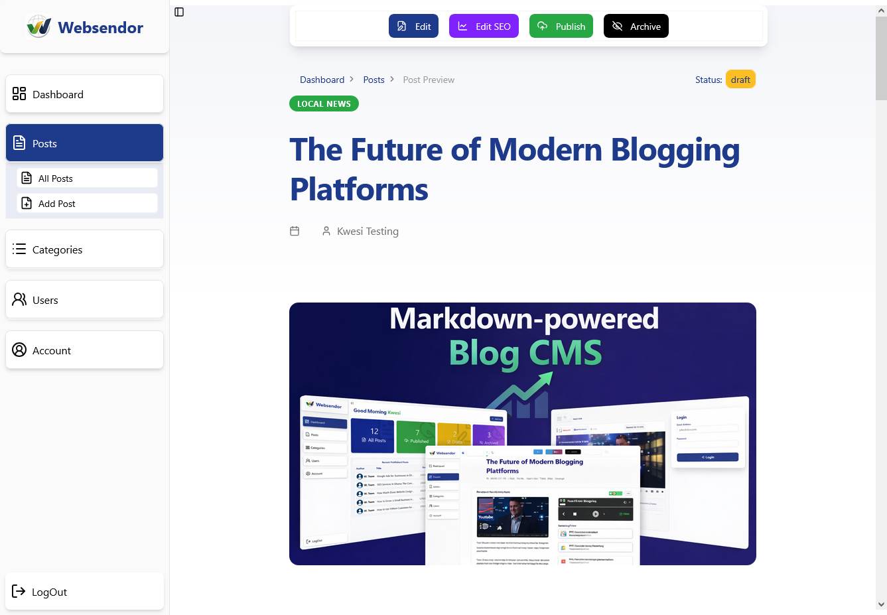
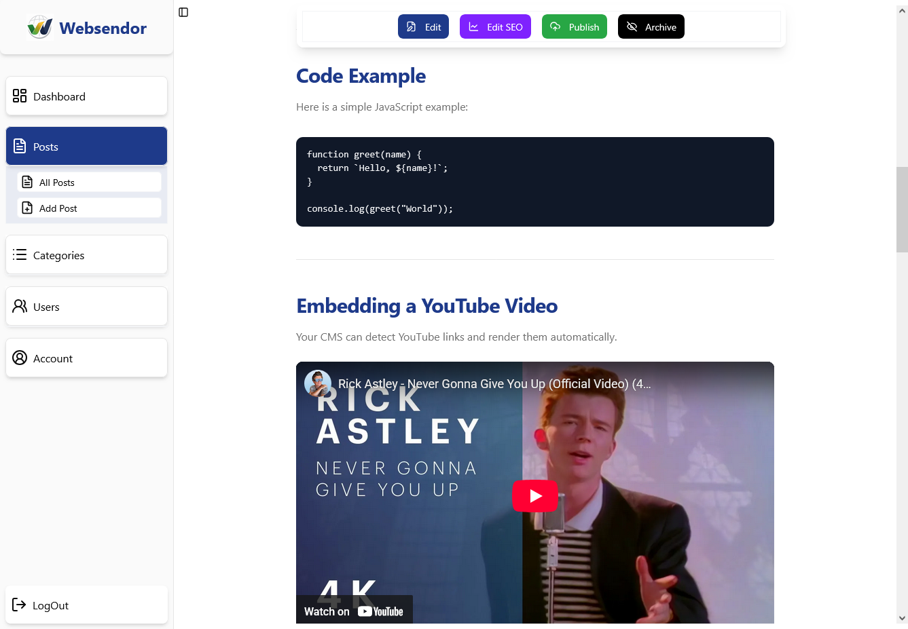
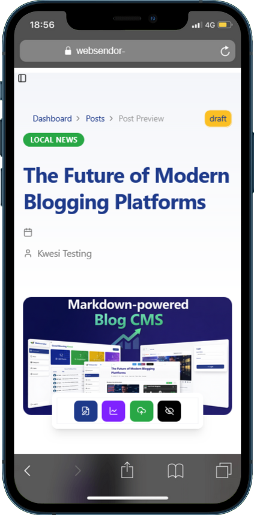
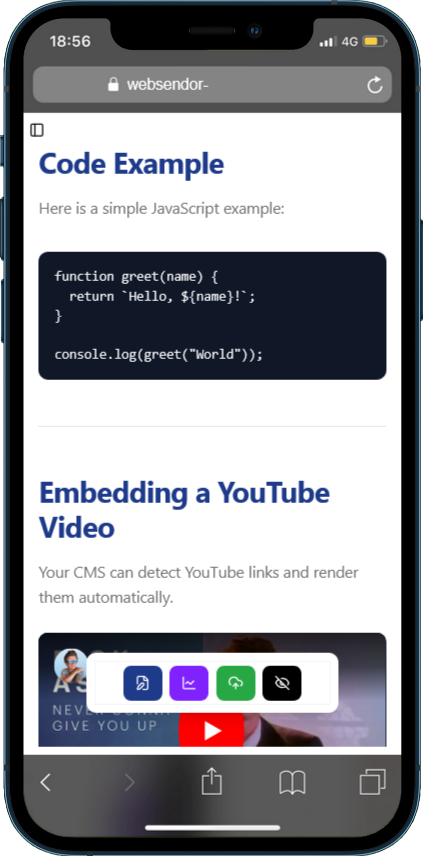
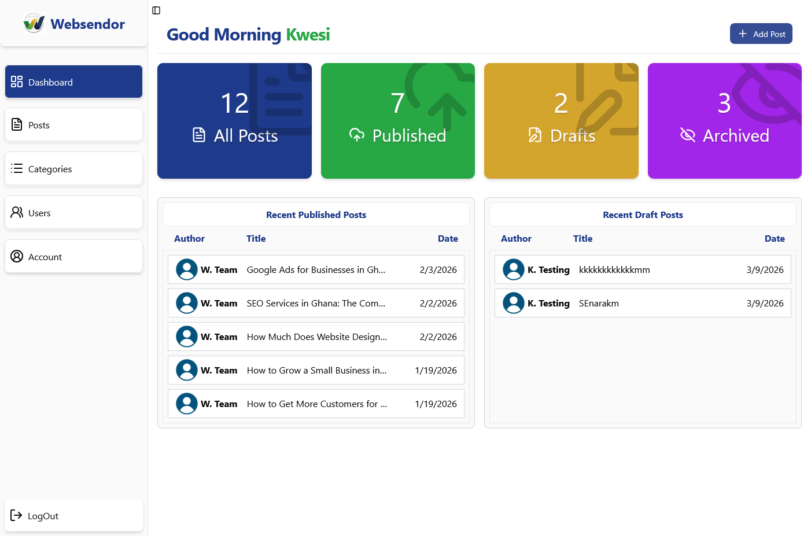

# Next.js Blog CMS

A full-stack **Markdown-powered Blog CMS** built with Next.js.
Write posts in Markdown, store the raw content in the database, and render it into rich HTML with automatic media embedding.


## Live Demo

Try the application here:

🔗 [https://websendor-blog.kencoding.dev/](https://websendor-blog.kencoding.dev/)

### Demo Account

Use the following credentials to explore the application:

Email: [testing@user.com](mailto:testing@user.com)
Password: testing1234

## Features

- Markdown-based blog writing
- Markdown stored directly in the database
- Markdown rendered to HTML using Remark
- Automatic media embed detection (YouTube, Vimeo, Spotify)
- File embedding support (PDF, Word, PowerPoint)
- Admin dashboard for managing blog posts
- Create, edit, and delete blog posts
- Responsive UI built with Tailwind CSS and shadcn/ui

## Tech Stack

Frontend

- Next.js
- React
- Tailwind CSS
- shadcn/ui

Backend

- Next.js Server Components / Server Actions
- Drizzle ORM

Database

- PostgreSQL

Content Processing

- Remark (Markdown → HTML)

--

## How It Works

This project is a Markdown-powered blog CMS.

When creating a post, the author writes content in Markdown. The raw Markdown is stored directly in the database instead of pre-rendered HTML.

When a post is previewed or displayed, the Markdown is processed through a custom rendering pipeline using Remark. During this process, the system detects supported media and file links and renders them appropriately.

Supported embedded content includes:

- YouTube videos
- Vimeo videos
- Spotify links
- PDF files
- Word documents
- PowerPoint files

Depending on the type of link, the system can render embedded previews or provide download/view functionality.

This approach keeps content flexible, preserves the original Markdown source, and allows custom rendering behavior for rich media.

## Why I Built It

I built this project to practice building a real-world full-stack content management system with modern web technologies.

The goal was not just to create a blog, but to build a platform that handles structured content authoring, Markdown processing, rich media embedding, and admin-side content management.

Through this project, I worked on backend logic, database design, authentication, content rendering, and UI architecture in a single application.

## Screenshots

### Blog Homepage



### Post Editor



### Post Preview









### Admin Dashboard



## Getting Started

Clone the repository:

```bash
git clone https://github.com/yourusername/nextjs-blog-cms.git
```

Navigate into the project directory:

```bash
cd nextjs-blog-cms
```

Install dependencies:

```bash
npm install
```

Create your environment variables:

```bash
cp .env.example .env
```

Fill in the required environment variables in your `.env` file.

Run the development server:

```bash
npm run dev
```

Then open:

```
http://localhost:3000
```

## Project Structure

```
src
│
├── app            # Next.js App Router pages and routes
├── components     # Reusable UI components
├── features       # Feature-based modules and business logic
├── lib            # Utilities, database, and shared logic
├── types          # Shared TypeScript types
```

## System Architecture

This CMS uses a **raw Markdown storage** approach.

When an author creates or updates a post, the content is written in Markdown and stored directly in the database without converting it to HTML first.

Rendering happens at display time through a custom `MarkdownRenderer` component. The renderer processes the Markdown content line by line and determines how each part should be displayed.

For links inside the content, the renderer applies custom detection logic to identify the type of resource, such as:

- standard links
- YouTube links
- Vimeo links
- Spotify links
- PDF files
- Word documents
- PowerPoint files

Based on the detected type, the renderer decides whether to display an embedded preview, a custom media block, or a file view/download interface.

This design keeps the database content portable and preserves the original Markdown source. It also separates **content storage** from **presentation logic**, making the rendering system reusable across any frontend that consumes the same post data.

## Technical Highlights

- Stores raw Markdown in the database instead of pre-rendered HTML
- Uses a custom `MarkdownRenderer` component for dynamic rendering
- Detects media and file links and renders them based on content type
- Separates content persistence from frontend presentation logic
- Supports reusable rendering logic for any application consuming the same content source

## Contributing

Contributions are welcome. If you would like to improve the project, feel free to fork the repository and submit a pull request.

## Author

Kennedy Senyo

GitHub: https://github.com/kennedysenyo
